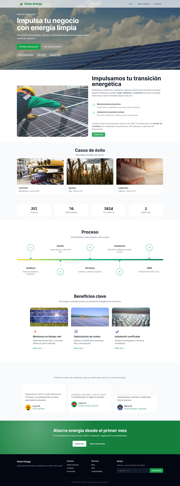

# 🌱 Green Energy

**Green Energy** es una aplicación web moderna para la presentación de servicios relacionados con energías renovables, centrada en el autoconsumo y la transición energética de empresas. Desarrollada con Next.js, Tailwind CSS y TypeScript, esta plataforma comunica con claridad la misión, servicios, proyectos y valores de una empresa del sector energético.

---

## 🚀 Características

- Diseño moderno, accesible y responsive
- Animaciones fluidas con Framer Motion
- Componentes reutilizables y modulares
- Página de inicio con estadísticas animadas
- Sección "Sobre nosotros" con línea de tiempo y valores
- Carrusel de estudios de caso y testimonios
- Sistema de preguntas frecuentes (FAQ)
- Optimización SEO básica

---

## 🛠️ Tecnologías usadas

- [Next.js 14](https://nextjs.org/)
- [React 18](https://react.dev/)
- [TypeScript](https://www.typescriptlang.org/)
- [Tailwind CSS](https://tailwindcss.com/)
- [Framer Motion](https://www.framer.com/motion/)
- [Lucide Icons](https://lucide.dev/)

---

## 📦 Instalación local

```bash
git clone https://github.com/tuusuario/greenEnergy.git
cd greenEnergy
npm install
npm run dev
```

Luego abre [http://localhost:3000](http://localhost:3000) en tu navegador.

---

## 🧾 Estructura del proyecto

```
.
├── components/         # Componentes reutilizables (Hero, Stats, Timeline...)
├── app/                # Rutas y páginas Next.js 14
├── public/             # Imágenes y recursos estáticos
├── styles/             # Estilos globales
├── tailwind.config.ts  # Configuración de Tailwind
├── tsconfig.json       # Configuración de TypeScript
└── README.md           # Este archivo
```

---

## 🤝 Contribución

¿Te gustaría contribuir? Toda ayuda es bienvenida.

1. Haz un fork del repositorio
2. Crea una nueva rama (`git checkout -b feature/nueva-funcionalidad`)
3. Realiza tus cambios
4. Haz un commit (`git commit -am 'Añadir nueva funcionalidad'`)
5. Haz push a la rama (`git push origin feature/nueva-funcionalidad`)
6. Abre un Pull Request

---

## 📄 Licencia

MIT © [TuNombre](https://github.com/OslarCode)

---

## 📷 Capturas de pantalla



---
